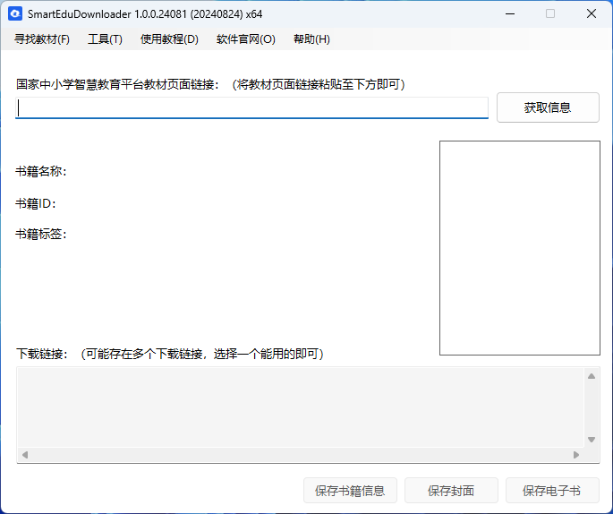

轻松、方便快捷地解析下载教材、课程资源！

<h1 align="center">
  <a href="https://github.com/cjhdevact/FlyEduDownloader">飞翔教学资源助手</a>
</h1>

如果你觉得这个项目对你有帮助，请给我们点一个 Star

  
  
  
  
  

飞翔教学资源助手可以解析下载国家中小学智慧教育平台教材、课程资源地址，支持批量下载，需要.Net Framwork 4.0以上版本支持。

<h3 align="center">
  <a href="https://github.com/cjhdevact/FlyEduDownloader/releases/latest">下载最新版本</a> | <a href="https://cjhdevact.github.io/otherprojects/FlyEduDownloader/feedback.html">问题反馈</a> | <a href="https://cjhdevact.github.io/otherprojects/FlyEduDownloader/index.html">官方主页</a> | <a href="https://cjhdevact.github.io/otherprojects/FlyEduDownloader/Help/index.html">使用教程</a>
</h3>

本软件完全免费开源，任何人不得用于商业用途，如果你下载本软件是付费后才可下载的，请立刻举报并反馈。

> [!NOTE]
>
> 2024-12-14 对无法下载mp4视频和可编辑格式课件说明
>
> 1.当前平台的课件均只能获取到pdf格式，可编辑格式只有平台的专有格式（用PPT软件无法打开的），而且无法直接获取下载链接。如果要可编辑格式，请自行登录平台，在课件预览的右下角点击全屏授课，再点右上角的另存副本，在线编辑。
>
> 2.视频下载:由于本软件没有添加ffmreg支持（主要考虑软件体积大小）,所以没有实现这个功能。但本软件可以下载M3U8列表文件，你可以手动通过其它方式通过该文件手动下载视频。

关键词：飞翔教学资源助手，飞翔教学资源助手官网，飞翔教材助手官网，飞翔教材助手，国家中小学智慧教育平台，智慧教育云，国家中小学智慧教育平台下载，2024新教材，2024新课标教材，新教材，国家中小学智慧教育平台403，国家中小学智慧教育平台下载报错，国家中小学教育云平台，电子教材，小学电子教材，初中电子教材，高中电子教材，电子教材下载器，人教版课本，人教版电子教材下载，统编版电子教材，统编版小学语文，统编版道德与法治，统编版初中语文，统编版初中政治，道德与法治，山东电子课本，五四制电子课本，鲁教版电子课本，鲁教版数学，鲁教版英语，日语课本，俄语课本，人教数学课本，人教英语课本，K12教育，双减政策，人教社，人教社电子教材，中小学电子教材，寒假，暑假，弯道超车，寒假预习，暑假预习，放假预习没有课本怎么办，去哪找电子教材，制作鬼畜课本，鬼畜课本怎么制作

## 功能说明

本程序支持的功能有：

- [x] 获取智慧教育平台电子教材、课程资源信息以及下载链接（支持2022新课标教材）
- [x] 免登录、登录下载智慧教育平台电子教材和课程资源
- [x] 自动识别教材标题，自动重命名
- [x] 批量解析和下载智慧教育平台电子教材链接
- [x] 其他一些小工具（如文本处理，批量下载文件（可以使用X-Nd-Auth标头批量下载获取到的教材以及课程资源PDF文件链接）...）
- [x] 100％开源。欢迎提出改进建议。

## 程序截图

## 开源说明

本软件仅使用了合法的下载技术，通过官方API获取教材链接，本软件自身不存储任何课本资源，课本资源均来自国家的开放平台。

在延伸的代码中（修改和由本仓库代码衍生的代码中）需要说明“`基于飞翔教学资源助手（https://github.com/cjhdevact/FlyEduDownloader）开发`”。

## 此项目使用的API

### 智慧教育平台教材下载

#### 链接格式：

普通教材：
`https://basic.smartedu.cn/tchMaterial/detail?contentType=assets_document&contentId=（教材contentId）&catalogType=tchMaterial&subCatalog=tchMaterial`

资源包教材：
`https://basic.smartedu.cn/tchMaterial/detail?contentType=thematic_course&contentId=（教材contentId）&catalogType=tchMaterial&subCatalog=tchMateria`

#### 解析接口：

普通教材动态解析，解析里面的PDF文件和标题，但是要带上X-Nd-Auth标头：
`https://s-file-2.ykt.cbern.com.cn/zxx/ndrv2/resources/tch_material/details/（教材contentId）.json`

资源包教材：
`https://s-file-1.ykt.cbern.com.cn/zxx/ndrs/special_edu/thematic_course/（教材contentId）/resources/list.json`

#### 示例网页链接

普通教材：

`https://basic.smartedu.cn/tchMaterial/detail?contentType=assets_document&contentId=bdc00134-465d-454b-a541-dcd0cec4d86e&catalogType=tchMaterial&subCatalog=tchMaterial` 

带资源包教材：

`https://basic.smartedu.cn/tchMaterial/detail?contentType=thematic_course&contentId=2afcdb56-6fce-8c99-0bc9-e9dd33b5c51c&catalogType=tchMaterial&subCatalog=tchMaterial`

### 智慧教育平台课程资源下载

#### 链接格式：

教育部资源：

`https://basic.smartedu.cn/syncClassroom/classActivity?activityId=（资源包activityId）&chapterId=&teachingmaterialId=&fromPrepare=0` 

学校提供网课：

`https://basic.smartedu.cn/qualityCourse?courseId=（资源包teachingmaterialId）&chapterId=&teachingmaterialId=&fromPrepare=0&classHourId=lesson_1`

备课：

`https://basic.smartedu.cn/syncClassroom/prepare/detail?lessonId=（资源包lessonId）&chapterId=&teachingmaterialId=&fromPrepare=1&classHourId=lesson_1`

#### 解析接口：

动态解析，解析里面的资源文件和标题，但是要带上X-Nd-Auth标头：

教育部资源：

`https://s-file-1.ykt.cbern.com.cn/zxx/ndrv2/national_lesson/resources/details/（资源包activityId）.json`

学校提供网课：

`https://s-file-2.ykt.cbern.com.cn/zxx/ndrv2/resources/（资源包teachingmaterialId）.json`

备课：

`https://s-file-2.ykt.cbern.com.cn/zxx/ndrv2/prepare_lesson/resources/details/（资源包lessonId）.json`

#### 示例网页链接

教育部资源：

`https://basic.smartedu.cn/syncClassroom/classActivity?activityId=f15feef1-b908-44f5-a765-500b9395c313&chapterId=8d6cc118-a169-3ea1-9a45-31cc841ad239&teachingmaterialId=4a4aa279-8dc6-4098-b45f-dd3f7d5a61b2&fromPrepare=0` 

学校提供网课：

`https://basic.smartedu.cn/qualityCourse?courseId=8ae7e48f-842c-12fc-0184-35dacdee016f&chapterId=8ae5c0d4-cfd4-34d1-9757-0295bd0c55ed&teachingmaterialId=4a4aa279-8dc6-4098-b45f-dd3f7d5a61b2&fromPrepare=0&classHourId=lesson_1`

备课：

`https://basic.smartedu.cn/syncClassroom/prepare/detail?lessonId=8aee80a5-6b86-5bc9-016b-87465e6e0290&chapterId=5bb731e1-cdac-3984-a977-3d44c5d2d809&teachingmaterialId=4a4aa279-8dc6-4098-b45f-dd3f7d5a61b2&fromPrepare=1&classHourId=lesson_1`

## 致谢

[AnyTextbookDownloader](https://gitlab.com/xiaoyangtech1/AnyTextbookDownloader) - 参考了教材部分下载思路。

------------

本程序基于 `GPL-3.0` 授权。
